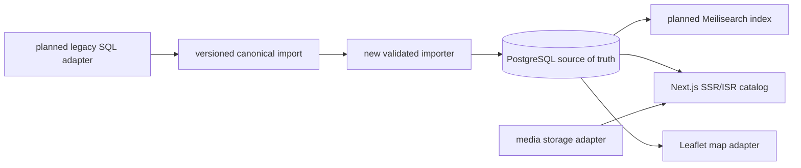

# Monuments public catalog modernization v1

## 📝 TLDR

The repository currently contains an approved product requirements document, but no implementation, public runtime, or executable validation suite. **Future behavior** is a fast, accessible Polish/English public monument catalog with searchable list and map browsing, stable detail pages, image galleries, and a controlled repeatable import from the legacy data.

The requirements span several independently deployable capabilities. Before architecture and implementation planning are expanded, the delivery shape and a few compatibility boundaries must be confirmed so this specification does not create one unmanageable program document or lock in an incorrect migration contract.

## 📝 Resolved scope decisions

- This remains one v1 umbrella specification with independently shippable phases, rather than a set of separate documents.
- The importer starts with a versioned canonical format; the legacy SQL dump and schema are not currently available and must be added through a later source adapter when obtained.
- v1 uses new stable human-readable URLs. Legacy URL preservation or redirects are not required by this scope.
- The map phase uses Leaflet behind a provider-neutral application adapter.

## 📝 Problem Statement

The existing product is a legacy Java EE/WildFly application from 2014. The approved PRD identifies the need to preserve useful monument data while replacing the runtime with a lightweight public catalog that can support search, maps, localization, media, SEO, responsive behavior, and WCAG 2.1 AA.

The current repository has no runtime implementation, database schema, import contract, or automated validation suite. The main risk is therefore not a small feature defect but choosing durable contracts too early: identifiers, localized fields, import repeatability, public URLs, media ownership, and the boundary between PostgreSQL and derived search/cache artifacts.

## 📝 Proposed Solution

Build a TypeScript/Next.js modular monolith under `apps/web/`, backed by PostgreSQL and run locally with Docker Compose. PostgreSQL remains the source of truth; Meilisearch indexes, generated image variants, and cached/revalidated pages are derived and rebuildable. The public experience is server-rendered or statically revalidated, supports Polish and English with Polish fallback, and exposes a list/map browsing flow.

The single v1 specification deliberately contains independently shippable phases rather than requiring all capabilities to launch together. The initial importer consumes a versioned canonical representation owned by this application. A later adapter converts the legacy SQL dump into that representation after its exact schema is available; the canonical path can be developed and tested with synthetic source fixtures now. This prevents the legacy database format from becoming a permanent application contract.

The selected map implementation is Leaflet behind an application map adapter. The adapter owns marker, clustering, viewport, and provider configuration concerns so a tile or map provider can change without changing monument domain logic. The v1 scope excludes administration, accounts, editorial workflow, PostGIS, legacy image migration, Kubernetes, microservices, and cloud-specific deployment.

## 📝 Research Notes

Open-source reference projects reinforce three design choices:

- OpenStreetMap treats geographic data as open, locally maintained information and requires attribution for use ([About OpenStreetMap](https://www.openstreetmap.org/about)). The catalog must keep map/tile attribution visible and make the provider replaceable rather than embedding provider policy in domain code.
- Wikimedia Commons uses multilingual, structured, machine-readable media metadata and explicit source/creator information ([Structured Data on Commons](https://commons.wikimedia.org/wiki/Commons:Structured_data)). Image assets should therefore carry language-aware captions/alt text, provenance, and license metadata instead of being anonymous file paths.
- Wikidata models stable entities through typed statements and external identifiers ([Data model](https://www.wikidata.org/wiki/Wikidata:Data_model)). The monument model should retain a stable external identifier from the canonical import, while avoiding a premature general-purpose knowledge graph.

These references suggest useful metadata and attribution practices, but they do not justify importing their complexity: v1 keeps one owned monument model, one canonical importer, and a narrow media contract.

## 📝 Architecture

### Components

| Component | Responsibility | Contract |
|---|---|---|
| `apps/web/catalog` | List/detail pages, stable slugs, locale selection, SEO metadata | Reads application services; never queries Meilisearch directly from UI components |
| `apps/web/search` | Search query, filters, ranking, index/rebuild adapter | Meilisearch is derived and can be rebuilt from PostgreSQL |
| `apps/web/map` | Leaflet rendering, marker clustering, viewport/bounds queries, attribution | Map provider details stay behind an adapter |
| `apps/web/media` | Upload validation, asset metadata, storage abstraction, gallery ordering | Local filesystem first; S3-compatible implementation remains a future adapter |
| `apps/web/i18n` | Supported locales and Polish fallback resolution | Missing English content resolves to Polish without mutating source data |
| `apps/web/import` | Canonical input validation, transformation, idempotent persistence, report generation | Legacy adapters produce canonical records; importer never executes arbitrary SQL |
| `apps/web/db` | PostgreSQL schema, migrations, repository queries | Database is the source of truth |
| `apps/web/ui` | Accessible shared presentation primitives | Components expose loading, empty, error, and narrow viewport states |
| `infra/` | Docker Compose, PostgreSQL, Meilisearch, local app dependencies | Local environment is reproducible and vendor-neutral |

The key boundary is the canonical import format: source-specific conversion happens before validation and persistence, while all public modules consume the normalized domain model.

### Runtime and consistency

Normal page reads use PostgreSQL-backed application services. Search results may come from Meilisearch, but detail pages always resolve the canonical monument from PostgreSQL. A successful import transaction emits or records an indexing/revalidation job; a failed derived-artifact update does not roll back committed source data, but leaves a visible rebuild-needed status and a repeatable repair command.

No background broker is required for v1. A database-backed job table or an explicit post-import command is sufficient until measured volume requires a separate worker. Long-running import and index rebuild commands must be resumable by batch and report their checkpoint.

## 📝 Data Model

The exact legacy field mapping remains intentionally open until the source dump is available. The target model must include:

- `monument`: internal UUID, stable `external_id`, canonical `slug`, latitude, longitude, region/location references, publication status, created/updated timestamps;
- `monument_translation`: monument reference, locale (`pl` or `en`), localized name, description, address/region labels, SEO title/description;
- `monument_image`: monument reference, storage key, original filename, MIME type, byte size, width/height, alt text/caption per supported locale, sort order, provenance/license fields, and processing status. Alt text and captions are authored per locale; rendering uses English when present and Polish fallback otherwise.
- `import_batch`: input version, source identifier, started/completed timestamps, status, counts, checksum, and report location;
- `import_record`: batch reference, source record hash, external ID, validation status, error codes, transformed fields, checkpoint state, and idempotency outcome.

`external_id` is unique within a declared source namespace. A source record hash lets a resumed batch distinguish an already applied record from a changed record. Resumption re-validates new or changed records and skips already-applied hashes; the unique external ID remains the final duplicate guard. Re-running the same canonical input updates the matching record or produces a no-op; it never creates a duplicate. Slugs are unique and changes require an explicit redirect or alias record once public pages exist.

Latitude and longitude are decimal fields with range validation. v1 does not use PostGIS or radius queries. Search documents and image variants are not authoritative tables and must have rebuild paths. No user accounts or sensitive personal data are introduced by this spec.

## 📝 API Contracts

These are planned application contracts; implementation may choose equivalent internal function names while preserving behavior.

### Public read endpoints

- `GET /api/monuments?page=&pageSize=&region=&locale=` returns `{items, page, pageSize, total, locale}`. Phase 3 provides bounded browsing and structural filters; keyword `q` is added by Phase 4 with Meilisearch. Invalid filters return a validation error rather than an unrestricted scan.
- `GET /api/monuments/:slug?locale=` returns a localized monument detail, gallery metadata, coordinates, and canonical URL. Missing English fields fall back to Polish and identify the resolved locale in the response.
- `GET /api/map/monuments?bbox=&locale=` returns marker-safe records within a bounded viewport. The endpoint rejects unbounded requests and does not expose unpublished records.
- Search requests use the search module’s contract and may identify whether results are index-backed; a detail lookup remains PostgreSQL-backed.

Public errors use stable machine-readable codes, human-safe localized messages, and correlation/request identifiers without leaking SQL, storage paths, or credentials. Responses include cache/revalidation metadata where applicable.

### Import commands

The implementation must provide repository-documented commands equivalent to:

- `import validate <canonical-input>` — validates schema and reports every invalid record without writing production data;
- `import run <canonical-input> --batch <id>` — validates, transforms, and persists idempotently with a durable report;
- `import rebuild-search [--batch <id>]` — rebuilds Meilisearch from PostgreSQL;
- `import revalidate [--batch <id>]` — revalidates affected public pages.

The canonical format must be versioned, checksummed, explicit about locale and source namespace, and safe to parse as data. No command may pass the legacy SQL dump directly to the target database.

## 📝 UI/UX

The public flow is: choose locale → browse the list → optionally switch to map → open a monument detail → browse its gallery. Phase 4 adds keyword search to the list; the list and map share filters and selection state where practical, but each remains usable when the other is unavailable.

Required states are:

- initial/loading: skeletons preserve layout and announce progress appropriately;
- empty: explain that no monuments match and provide a clear way to remove filters;
- error: localized recovery message and retry; map/search failure must not blank the catalog detail flow;
- long content and missing translation: readable truncation/expansion rules, Polish fallback, and meaningful alt text;
- narrow viewport: keyboard and touch usable list/map controls, no horizontal overflow;
- missing coordinates or images: detail remains useful without a marker or gallery.

Leaflet must include visible attribution and keyboard-accessible controls. Color is not the sole status signal. Public pages need semantic headings, focus order, labels, reduced-motion respect, and WCAG 2.1 AA contrast/interaction behavior. No administration UI is included.

## 📝 Edge Cases & Failure Scenarios

| Scenario | Required behavior |
|---|---|
| Duplicate `external_id` in one input | Reject the conflicting record, report both locations, and do not silently choose one. |
| Same canonical input imported twice | Second run is a no-op or deterministic update; report counts prove no duplicates. |
| Missing English translation | Serve Polish content and expose the resolved locale; never show an empty English shell. |
| Invalid coordinates | Keep the record out of map results, report the validation error, and keep other valid fields available only if publication rules allow. |
| Search index unavailable | Show a recoverable search error or bounded PostgreSQL fallback only if explicitly implemented; never perform an unrestricted table scan. |
| Index partially updated | Keep PostgreSQL-backed detail pages available and expose a rebuild-needed status. |
| Image too large, unsupported, or corrupt | Reject before persistence, report a safe user-facing error, and retain existing gallery assets. |
| Storage or thumbnail failure | Preserve the source asset status, show a placeholder with alt text, and make processing retryable. |
| Map/tile provider unavailable | Keep list/detail browsing functional and show a localized map-unavailable state with attribution when tiles recover. |
| Import interrupted | Resume from a durable batch checkpoint without duplicating committed records. |
| Malicious SQL or markup in source data | Treat input as data, parameterize persistence, sanitize rendered rich text, and never execute source SQL. |

## 📝 Risks & Impact Review

- **High — imported data becomes a contract.** Mitigation: versioned canonical input, source namespace, checksums, explicit transformation reports, and no direct SQL execution.
- **High — public identifiers and URLs are hard to change.** V1 deliberately introduces new stable human-readable URLs rather than promising legacy URL compatibility; slug aliases/redirects remain required before publishing a record whose slug changes.
- **Medium — derived search/cache drift.** PostgreSQL remains authoritative; rebuild and revalidation commands are release requirements, not optional operational polish.
- **Medium — map and media providers impose policy or cost.** Attribution, provider adapters, bounded requests, and local filesystem storage keep replacement possible. Provider credentials must not enter the repository.
- **Medium — broad single-spec scope.** This document is an umbrella for one v1 outcome, but every phase is independently testable and shippable; implementation must not merge all phases into one unreviewable change.
- **Low — future hosting remains undecided.** Docker Compose and vendor-neutral interfaces are the reversible local contract; deployment selection is explicitly deferred.

Compatibility follows `BACKWARD_COMPATIBILITY.md`: the PRD is currently the protected planning contract, and each future public URL, response shape, import format, migration, search document, media interface, and local command must be recorded before being treated as stable.

## 📋 Phasing

1. **Domain and database foundation:** schema, migrations, locale model, repository services, Docker Compose, and a health-checked empty app.
2. **Controlled canonical import:** versioned input schema, validation, idempotent persistence, durable reports, and a synthetic fixture dataset.
3. **Public catalog:** list/detail pages, stable slugs, SSR/ISR, locale switch, Polish fallback, and SEO metadata.
4. **Search:** Meilisearch indexing, filters, ranking, rebuild, and degraded failure states.
5. **Map:** Leaflet adapter, bounded marker endpoint, clustering, list/map synchronization, attribution, and no-coordinate behavior.
6. **Media:** validated image ingestion, local storage adapter, metadata, gallery, thumbnails, and future S3-compatible interface.
7. **Quality hardening:** responsive and WCAG 2.1 AA verification, performance checks at approximately 10,000 records, import consistency, security review, and release runbook.

Each phase may be released only when its own acceptance tests pass and its contracts do not depend on an unfinished later phase. Search, map, and media enhance the catalog but do not make the core list/detail flow unusable when their external systems fail. Phase 7 is intentionally a cross-phase release-readiness pass; its scale tests run after the relevant capabilities exist and are not prerequisites for shipping the earlier media phase.

## 📋 Implementation Plan

### Phase 1 — Domain and database foundation

1. **Create the Next.js modular-monolith shell and Docker Compose services.** Add health checks for the app, PostgreSQL, and Meilisearch; verify a fresh checkout starts with documented commands and a basic route responds.
2. **Define PostgreSQL migrations for monuments, translations, images, import batches, and import records.** Test migration up/down behavior and uniqueness/range constraints against an empty database.
3. **Implement locale resolution and repository services.** Test Polish defaulting, English fallback, unpublished filtering, stable slug lookup, and bounded pagination using fixture data.
4. **Add a minimal catalog health page and CI-ready validation commands.** Typecheck, lint, unit-test, and build the empty application so the repository no longer relies on an empty validation gate.

### Phase 2 — Controlled canonical import

5. **Define and version the canonical import schema.** Validate source namespace, external ID, locale, coordinates, translations, images, and checksum; add valid/invalid fixtures.
6. **Implement validation-only reporting.** Test that every invalid record receives a stable error code and that validation performs no production writes.
7. **Implement idempotent batch persistence and checkpoints.** Test first import, repeated import, deterministic updates, duplicate conflicts, interruption/resume, and transaction rollback.
8. **Add a synthetic source-adapter fixture and report artifact.** Prove that an adapter emits canonical input without executing SQL and that invalid/skipped/transformed counts are explicit. Keep the real legacy SQL mapping as a follow-on implementation once the dump and schema are supplied.

### Phase 3 — Public catalog

9. **Implement paginated/streamed list and detail application services.** Test bounded filters, stable ordering, unpublished exclusion, slug lookup, missing records, and locale fallback.
10. **Build accessible list and detail pages with SSR/ISR metadata.** Test loading, empty, error, long-content, missing-image, keyboard, narrow-viewport, and SEO states.
11. **Add stable canonical URL generation and change handling.** Test slug uniqueness and the selected v1 policy for new URLs; require an alias/redirect migration whenever a published slug changes.

### Phase 4 — Search

12. **Define the Meilisearch document mapper and index settings.** Test localized fields, searchable/filterable attributes, stable external IDs, and safe rebuild from PostgreSQL.
13. **Implement indexing after import and explicit rebuild commands.** Test partial failure reporting, retry/resume behavior, and that source data remains available when indexing fails.
14. **Connect search UI and filters to the catalog flow.** Test query validation, empty results, ranking smoke cases, Polish fallback, and bounded behavior when Meilisearch is unavailable.

### Phase 5 — Map

15. **Implement the provider-neutral map adapter with Leaflet.** Test marker rendering, clustering thresholds, attribution, keyboard controls, and provider configuration without domain imports.
16. **Implement bounded viewport marker queries.** Test bbox validation, maximum result limits, missing coordinates, unpublished records, and list/map selection synchronization.
17. **Add map failure and responsive states.** Test that tile/provider failure preserves list/detail use and that narrow/touch layouts have no horizontal overflow.

### Phase 6 — Media

18. **Implement image boundary validation and metadata persistence.** Test MIME/size/dimension validation, corrupt files, safe filenames, per-locale alt text/captions with Polish fallback, provenance, and license fields.
19. **Implement local filesystem storage and processing status.** Test path isolation, retryable thumbnail failure, gallery ordering, deletion/rollback behavior, and no credential leakage.
20. **Render accessible galleries and define the S3-compatible adapter boundary.** Test missing images, localized alt text, keyboard navigation, responsive variants, and provider-independent domain behavior.

### Phase 7 — Quality hardening

21. **Load-test list, detail, search, and bounded map queries with approximately 10,000 monuments.** Record response budgets and reject regressions against agreed thresholds.
22. **Run WCAG 2.1 AA, responsive, SEO, and browser integration checks.** Cover the required state matrix and preserve screenshots/reports as QA evidence.
23. **Run import consistency and recovery drills.** Verify rebuildable search, repeatable import, interrupted batch recovery, migration rollback, and report completeness. When the legacy dump and schema are supplied, add and run the real source adapter before declaring the v1 migration acceptance complete.
24. **Complete security and release review.** Check SQL/HTML/upload handling, attribution, cache invalidation, operational runbook, deferred hosting decision, and the protected contracts in `BACKWARD_COMPATIBILITY.md`.